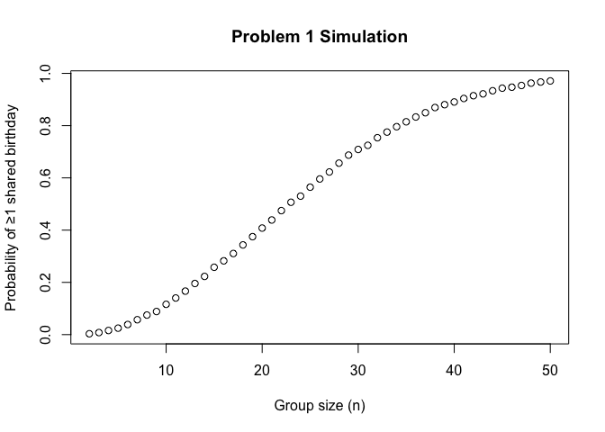
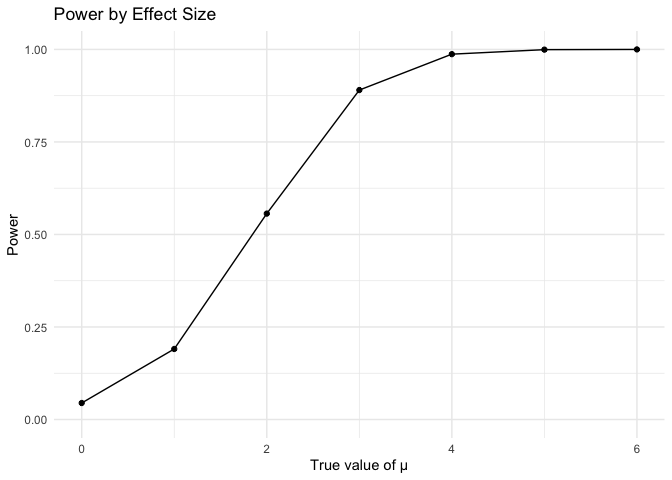
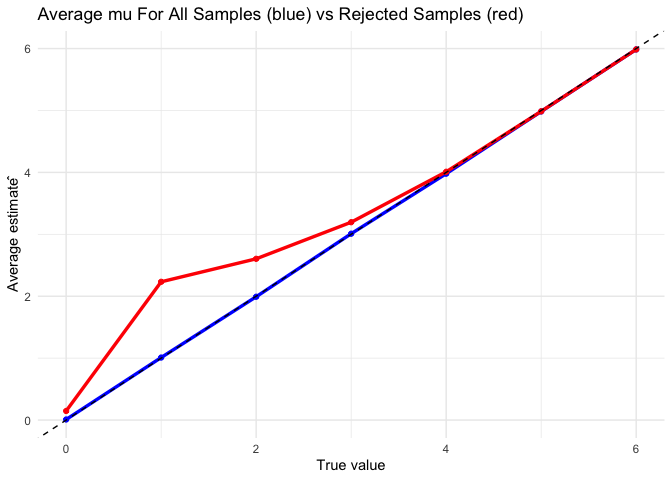

p8105_hw3_kg3006
================
Kevin Guzman
2025-10-09

## Problem 1

The graph below demonstrates the probability that there is at least 1
shared birthday in a group of individuals from a group of 2 people to 50
simulated over 10,000 trials.
<!-- -->

As noted in the graph. As the group sizes increase, the probabiliyt of a
shared birthday also increases. Interestingly, even though there are 365
possible birthdays. The probability of a shared birthday among a group
of 25 people is already over 50% and that of a group of 50 people is
nearly 100%!

## Problem 2

### Part A

This figure shows that at mean of 0, the power to detect a differnece is
0.05, as we increased the true mean value, the power to detect a
difference also increases and approaches 100% by a true mean value of 4.
<!-- -->

### Part B

The simulated value of mu in our simmulation with 5,000 simulation
approximates that of the true value of mu quite well. When you look at
only those where the t-test rejected the hypothesis though. You see
that, for the smaller subsets the ones that were rejected had means that
were far away from the true value.

<!-- -->

## Problem 3

The Washington Post Homicide Data contains information on homicides in
the United States from 2007-01-01 to 2017-12-31. It contains a total of
52179 observations and 12 variables. Key variables that it contains are
the victims name, race, age, sex, city, state, and disposition of the
homicide case.

### Homocides in Baltimore, MD

The proportion of unsolved homicides in Baltimore, MD is estimated to be
0.646, with a 95% confidence interval ranging from 0.628 to 0.663.
